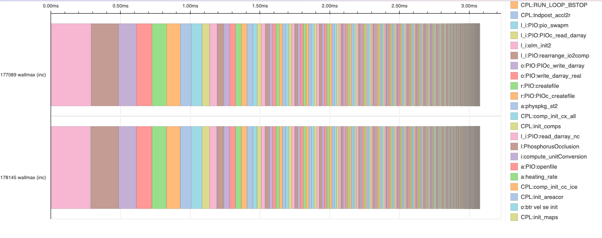
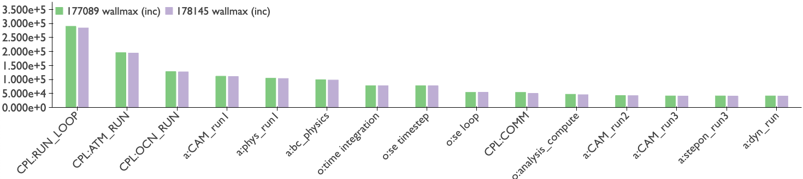
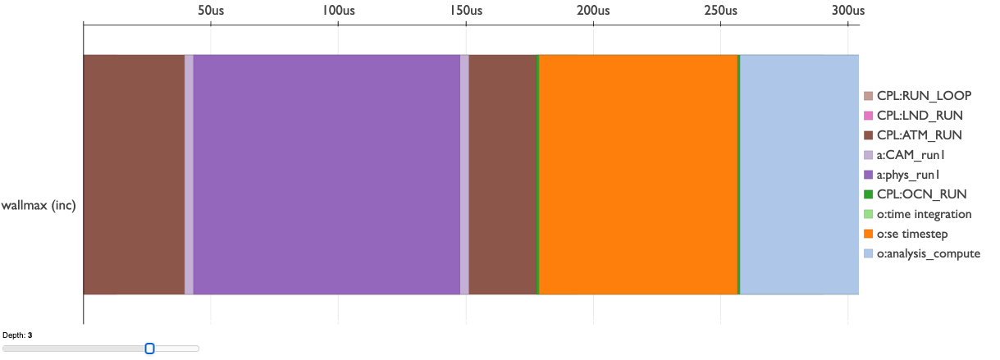

# Pace-Hatchet-Integration
This repo provides a few end-to-end functions to take experiments hosted in PACE 
and create performance comparison visualizations. This is done on the underlying 
*GraphFrame* data structure of hatchet. Hatchet is used to ingest the profile data,
then the data from hatchet is used to create custom plots. The code found in 
`src/plotting` is responsible for creating these bokeh plots, while the 
`src/gptl_timing.py` file holds all the setup functions needed to ingest the data 
and the end-to-end functions to get the data and create a plot.

___
# End-to-end Functions
**All of the functions listed below are located in the `src/gptl_timing.py` file.**

### *`get_profile_timeline`*
* Input
  * `exp_ids: [int]`
    * list of experiment ids to be compared
  * `group_by: str = 'name'`
    * which column to use to group (this is usually the name column)
  * `compare: str = 'wallmax (inc)'`
    * which metric to compare the experiments on
* Output
  <!-- import photo from plot screenshots folder -->
  

### *`get_operation_histogram`*
* Input
  * `exp_ids: [int]`
    * list of experiment ids to be compared
  * `group_by: str = 'name'`
    * which column to use to group (this is usually the name column)
  * `compare: str = 'wallmax (inc)'`
    * which metric to compare the experiments on
  * `num_cols: int = 15`
    * number of operations to compare
* Output
  <!-- import photo from plot screenshots folder -->
  
### *`get_profile_trace_view`*
* Input
  * `exp_id: int`
    * experiment id to be inspected
  * `metric: str = 'wallmax (inc)'`
    * which metric to compare the experiments on
  * `filter_scale: float = 0.02`
    * specify which percentage of lowest values to drop from the data
* Output
  <!-- import photo from plot screenshots folder -->
  

___
# Setup
In addition to the files here, hatchet is needed for ingesting the GPTL profile
data. The main hatchet pip package is not update for these functions, thus we will
have to install it locally.
### Hatchet Installation Steps
1. Clone the [git repo](https://github.com/amovsesyan/hatchet)
2. Checkout the *`intersect`* branch
3. Install locally with pip:
   * `pip install -e <path_to_hatchet>`

